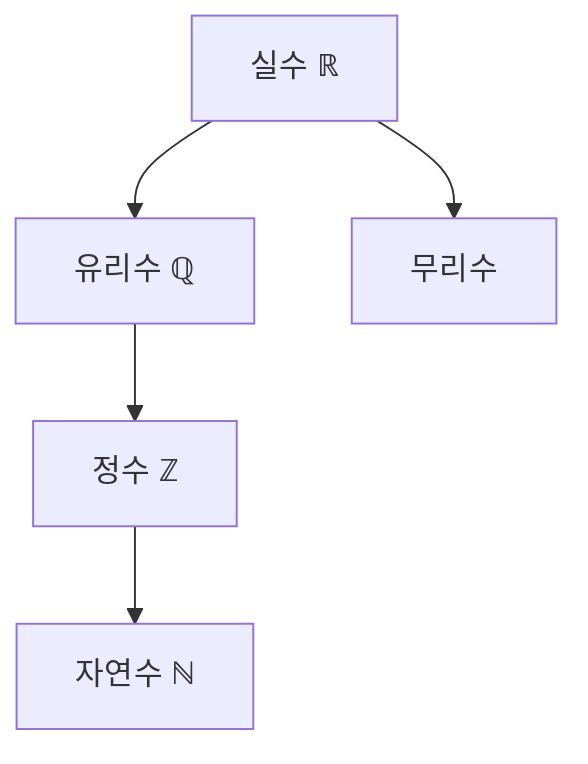

# 28장. Number

자바스크립트에서 숫자를 다루는 표준 내장 객체로, 숫자 값을 감싸는 래퍼(wrapper) 객체를 생성합니다.

## Number 타입의 특징

- **IEEE 754**: 자바스크립트의 Number 타입은 IEEE 754 표준을 따르는 64비트 부동소수점 형식으로 구현됨
- **정수와 실수의 통합**: 자바스크립트는 정수와 실수를 구분하지 않고 모두 Number 타입으로 처리
- **표현 범위**: ±(2^-1074) ~ ±(2^1023 × (2-2^-52))
- **안전한 정수 범위**: -(2^53 - 1) ~ (2^53 - 1) 사이의 정수만 정확하게 표현 가능
- **부동소수점 연산의 한계**: 계산 결과가 정확하지 않을 수 있음 (`0.1 + 0.2 !== 0.3`)

## Number 생성자 함수

#### `new Number()`로 호출시

- `new` 연산자와 함께 호출하면 `[[NumberData]]` 내부 슬롯에 값을 할당한 Number 래퍼 객체를 생성
- 인수를 전달하지 않을 시 기본값 0 할당
- 숫자가 아닌 값을 인수로 전달하면 인수를 강제 숫자 변환 후 이를 감싸는 Number 래퍼 객체 반환

```js
const numObj1 = new Number(); // Number {0}
const numObj2 = new Number("123"); // Number {123}
const numObj3 = new Number(true); // Number {1}
```

#### `Number()`로 호출 시 (new 없이)

- new 연산자 없이 호출하면 인스턴스가 아닌 원시 숫자 값을 반환 (명시적 타입 변환)
- 전달된 파라미터는 숫자로 강제 변환 (원시값)

```js
// 숫자로 변환
Number("123"); // 123 (숫자)
Number(false); // 0
Number(null); // 0

// 숫자로 변환되지 않는 값 NaN
Number("foo"); // NaN
Number(undefined); // NaN
Number(Symbol()); // TypeError: Cannot convert a Symbol value to a number
```

## 원시 값과 래퍼 객체

- 자바스크립트에서는 원시 값(primitive value)인 숫자에 대해 프로퍼티나 메서드를 호출할 수 있다.
- 원시 값이 일시적으로 래퍼 객체로 변환되기 때문

```js
const num = 10; // 원시 숫자 값
console.log(num.toString()); // "10"

// 위 코드는 내부적으로 다음과 같이 처리됨
// const temp = new Number(num);
// const result = temp.toString();
// temp는 가비지 컬렉션의 대상이 됨
```

## Number 프로퍼티

#### `Number.EPSILON`

> JavaScript에서 표현할 수 있는 가장 작은 양수(1보다 큰) 차이

- 특징:
  - 값: 약 2.220446049250313e-16
  - 1과 1보다 큰 숫자 중에서 가장 작은 숫자와의 차이
  - 부동소수점 연산에서 발생하는 오차를 비교할 때 사용
  - 두 수의 차이가 EPSILON보다 작으면 같은 수로 간주

```js
console.log(Number.EPSILON); // 2.220446049250313e-16

// 부동소수점 비교
const a = 0.1 + 0.2; // 0.30000000000000004
const b = 0.3;
console.log(a === b); // false
console.log(Math.abs(a - b) < Number.EPSILON); // true
```

#### `Number.MAX_VALUE`

> JavaScript에서 표현할 수 있는 가장 큰 양수

- 특징:
  - 값: 약 1.7976931348623157e+308
  - 이보다 큰 수는 Infinity로 처리됨

```js
console.log(Number.MAX_VALUE); // 1.7976931348623157e+308
console.log(Number.MAX_VALUE * 2); // Infinity
```

#### `Number.MIN_VALUE`

> JavaScript에서 표현할 수 있는 가장 작은 양수

- 특징:
  - 값: 약 5e-324
  - 이보다 작은 양수는 0으로 처리됨

```js
console.log(Number.MIN_VALUE); // 5e-324
console.log(Number.MIN_VALUE / 2); // 0
```

#### `Number.MAX_SAFE_INTEGER`

> JavaScript에서 안전하게 표현할 수 있는 가장 큰 정수

- 특징:
  - 값: 2^53 - 1 (9007199254740991)
  - 이보다 큰 정수는 정확하게 표현되지 않을 수 있음
  - "안전한 정수"란 IEEE-754 표현에서 정확히 하나의 표현을 가지는 정수를 의미

```js
console.log(Number.MAX_SAFE_INTEGER); // 9007199254740991
console.log(Number.MAX_SAFE_INTEGER + 1); // 9007199254740992
console.log(Number.MAX_SAFE_INTEGER + 2); // 9007199254740992 (증가하지 않음)
console.log(Number.MAX_SAFE_INTEGER + 1 === Number.MAX_SAFE_INTEGER + 2); // true
```

#### `Number.MIN_SAFE_INTEGER`

> JavaScript에서 안전하게 표현할 수 있는 가장 작은 정수

- 특징:
  - 값: -(2^53 - 1) (-9007199254740991)
  - 이보다 작은 정수는 정확하게 표현되지 않을 수 있음

```js
console.log(Number.MIN_SAFE_INTEGER); // -9007199254740991
console.log(Number.MIN_SAFE_INTEGER - 1); // -9007199254740992
console.log(Number.MIN_SAFE_INTEGER - 2); // -9007199254740992 (감소하지 않음)
console.log(Number.MIN_SAFE_INTEGER - 1 === Number.MIN_SAFE_INTEGER - 2); // true
```

#### `Number.POSITIVE_INFINITY`

> 양의 무한대를 나타내는 값

- 특징:
  - Infinity와 동일
  - 양수를 0으로 나누거나 MAX_VALUE를 초과하는 연산 결과

```js
console.log(Number.POSITIVE_INFINITY); // Infinity
console.log(1 / 0); // Infinity
console.log(Number.MAX_VALUE * 2); // Infinity
```

#### `Number.NEGATIVE_INFINITY`

> 음의 무한대를 나타내는 값

- 특징:
  - -Infinity와 동일
  - 음수를 0으로 나누거나 -MAX_VALUE보다 작은 연산 결과

```js
console.log(Number.NEGATIVE_INFINITY); // -Infinity
console.log(-1 / 0); // -Infinity
console.log(-Number.MAX_VALUE * 2); // -Infinity
```

#### `Number.NaN`

> Not a Number를 나타내는 값

- 특징:
  - 글로벌 NaN과 동일
  - 숫자로 변환할 수 없는 연산 결과
  - 자기 자신과도 같지 않은 유일한 값(IEEE 754 명세)
  - `NaN === NaN`은 항상 false

```js
console.log(Number.NaN); // NaN
console.log(Number.NaN === NaN); // false (NaN은 자기 자신과도 같지 않음)
console.log(0 / 0); // NaN
console.log(parseInt("abc")); // NaN
```

## Number 정적 메서드

#### `Number.isFinite()`

> 전달된 값이 유한수인지 확인

- 특징:
  - 전역 isFinite()와 달리 암묵적 타입 변환을 하지 않음
  - 숫자가 아닌 값은 무조건 false 반환
  - Infinity, -Infinity, NaN는 false 반환

```js
// Number.isFinite vs 전역 isFinite 비교
console.log(Number.isFinite(0)); // true
console.log(Number.isFinite(2e64)); // true
console.log(Number.isFinite(Infinity)); // false
console.log(Number.isFinite(NaN)); // false

// 타입 변환 차이
console.log(Number.isFinite("0")); // false (문자열이므로)
console.log(isFinite("0")); // true (암묵적으로 숫자로 변환)

console.log(Number.isFinite(null)); // false
console.log(isFinite(null)); // true (0으로 변환)
```

#### `Number.isInteger()`

> 전달된 값이 정수인지 확인

- 특징:
  - 소수점 이하가 없는 숫자인지 확인
  - 숫자가 아닌 값은 false 반환 (타입 변환 없음)

```js
console.log(Number.isInteger(0)); // true
console.log(Number.isInteger(1.0)); // true (1.0은 1과 같은 정수)
console.log(Number.isInteger(-100000)); // true
console.log(Number.isInteger(0.1)); // false
console.log(Number.isInteger("0")); // false (문자열이므로)
```

#### `Number.isNaN()`

> 전달된 값이 NaN인지 확인

- 특징:
  - 전역 isNaN()과 달리 암묵적 타입 변환을 하지 않음
  - 숫자가 아닌 값은 false 반환
  - NaN만 true 반환

```js
// Number.isNaN vs 전역 isNaN 비교
console.log(Number.isNaN(NaN)); // true
console.log(Number.isNaN(Number.NaN)); // true

console.log(Number.isNaN("NaN")); // false (문자열이므로)
console.log(isNaN("NaN")); // true (암묵적으로 변환 시도 후 NaN)

console.log(Number.isNaN(undefined)); // false
console.log(isNaN(undefined)); // true (암묵적으로 변환 시도 후 NaN)
```

#### `Number.isSafeInteger()`

> 전달된 값이 안전한 정수인지 확인

- 특징:
  - MIN_SAFE_INTEGER와 MAX_SAFE_INTEGER 사이의 정수인지 확인
  - 정수가 아닌 값은 false 반환
  - 숫자가 아닌 값은 false 반환 (타입 변환 없음)

```js
console.log(Number.isSafeInteger(3)); // true
console.log(Number.isSafeInteger(Math.pow(2, 53) - 1)); // true (MAX_SAFE_INTEGER)
console.log(Number.isSafeInteger(Math.pow(2, 53))); // false (안전하지 않음)
console.log(Number.isSafeInteger(2.5)); // false (정수가 아님)
console.log(Number.isSafeInteger("3")); // false (숫자가 아님)
```

#### `Number.parseFloat()`

> 문자열을 파싱하여 부동소수점 숫자로 반환 (ES6)

- 특징:
  - 전역 parseFloat() 함수와 동일하게 동작
  - 문자열의 앞 부분부터 숫자로 변환 가능한 부분까지만 변환
  - 변환할 수 없으면 NaN 반환

```js
console.log(Number.parseFloat("3.14")); // 3.14
console.log(Number.parseFloat("3.14abc")); // 3.14 (숫자로 시작하는 부분만)
console.log(Number.parseFloat("3.14e2")); // 314 (지수 표기법 인식)
console.log(Number.parseFloat("  3.14  ")); // 3.14 (앞뒤 공백 무시)
console.log(Number.parseFloat("abc")); // NaN (숫자로 시작하지 않음)
```

#### `Number.parseInt()`

> 문자열을 파싱하여 특정 진수의 정수로 반환 (ES6)

- 특징:
  - 전역 parseInt() 함수와 동일하게 동작
  - 첫 번째 인수: 파싱할 문자열
  - 두 번째 인수: 진수(기수, 2~36), 기본값 10
  - 변환할 수 없으면 NaN 반환

```js
console.log(Number.parseInt("10")); // 10 (10진수로 해석)
console.log(Number.parseInt("10", 2)); // 2 (2진수로 해석)
console.log(Number.parseInt("10", 8)); // 8 (8진수로 해석)
console.log(Number.parseInt("10", 16)); // 16 (16진수로 해석)
console.log(Number.parseInt("0xFF")); // 255 (16진수로 인식)
console.log(Number.parseInt("10.5")); // 10 (소수점 이하 무시)
```

## Number 인스턴스 메서드

#### `Number.prototype.toExponential()`

> 숫자를 지수 표기법으로 변환하여 문자열 반환

- 특징:
  - 인수: 소수점 이하 자릿수(0-20, 선택적)
  - 형식: m.nnnne±xx (m: 정수 한 자리, n: 소수점 이하, e: 지수 표기, xx: 지수)
  - 반환값: 문자열

```js
const num = 77.1234;
console.log(num.toExponential()); // "7.71234e+1"
console.log(num.toExponential(2)); // "7.71e+1"
console.log(num.toExponential(0)); // "8e+1" (반올림)

// 숫자 리터럴에서 직접 사용 시 주의점
console.log((77.1234).toExponential()); // "7.71234e+1"
// console.log(77.toExponential()); // SyntaxError: Invalid or unexpected token
console.log((77).toExponential()); // "7.7e+1" (괄호 필요)
```

#### `Number.prototype.toFixed()`

> 숫자를 지정된 소수점 자릿수로 반올림하여 문자열 반환

- 특징:
  - 인수: 소수점 이하 자릿수(0-20, 기본값 0)
  - 지정된 자릿수보다 큰 경우 반올림
  - 지정된 자릿수가 원래 숫자의 소수점 이하 자릿수보다 크면 0으로 채움
  - 반환값: 문자열

```js
const num = 123.456;
console.log(num.toFixed()); // "123" (기본값 0)
console.log(num.toFixed(1)); // "123.5" (반올림)
console.log(num.toFixed(2)); // "123.46" (반올림)
console.log(num.toFixed(5)); // "123.45600" (0으로 채움)

// 지수 표기법으로 표현된 숫자에도 사용 가능
console.log((1.23e5).toFixed(2)); // "123000.00"
```

#### `Number.prototype.toPrecision()`

> 숫자를 지정된 정밀도(전체 자릿수)로 반올림하여 문자열 반환

- 특징:
  - 인수: 전체 자릿수(1-21, 선택적)
  - 인수를 생략하면 toString()과 동일하게 동작
  - 정밀도에 따라 고정 소수점 또는 지수 표기법으로 변환
  - 반환값: 문자열

```js
const num = 123.456;
console.log(num.toPrecision()); // "123.456" (toString()과 동일)
console.log(num.toPrecision(5)); // "123.46" (5자리로 반올림)
console.log(num.toPrecision(2)); // "1.2e+2" (2자리만 표현, 지수 표기법)
console.log(num.toPrecision(7)); // "123.4560" (0으로 채움)

const small = 0.000123;
console.log(small.toPrecision(5)); // "0.00012300" (5자리로 표현)
console.log(small.toPrecision(2)); // "0.00012" (2자리로 표현)
console.log(small.toPrecision(1)); // "0.0001" (1자리로 표현, 반올림)
```

#### `Number.prototype.toString()`

> 숫자를 지정된 진수의 문자열로 변환

- 특징:
  - 인수: 기수(2-36, 기본값 10)
  - 반환값: 문자열
  - Number.prototype.valueOf()는 원시 숫자 값 반환

```js
const num = 10;
console.log(num.toString()); // "10" (10진법)
console.log(num.toString(2)); // "1010" (2진법)
console.log(num.toString(8)); // "12" (8진법)
console.log(num.toString(16)); // "a" (16진법)

// 음수인 경우
console.log((-10).toString(2)); // "-1010"

// 부동소수점인 경우
console.log((10.5).toString(2)); // "1010.1"
```

#### `Number.prototype.valueOf()`

> Number 객체의 원시 값을 반환

- 특징:
  - 래퍼 객체에서 원시 값을 추출
  - 자바스크립트 엔진이 자동 호출하는 경우가 많음

```js
const numObj = new Number(10);
console.log(numObj); // Number {10}
console.log(typeof numObj); // "object"

const numValue = numObj.valueOf();
console.log(numValue); // 10
console.log(typeof numValue); // "number"

// 자동 호출 예시
console.log(numObj + 20); // 30 (valueOf() 자동 호출)
```

## 다른 숫자 관련 기능

### `BigInt` - 큰 정수 처리

ES2020에서 도입된 새로운 원시 타입으로, Number가 안전하게 표현할 수 있는 범위를 넘어서는 정수를 다룸.

```js
// BigInt 생성 (끝에 n 추가)
const bigNumber = 9007199254740991n; // MAX_SAFE_INTEGER
const bigNumber2 = BigInt("9007199254740991");
console.log(bigNumber === bigNumber2); // true

// 산술 연산
console.log(bigNumber + 1n); // 9007199254740992n
console.log(bigNumber * 2n); // 18014398509481982n

// Number와 BigInt는 연산 불가
// console.log(bigNumber + 1); // TypeError
```


## 부동소수점 정밀도 문제

IEEE 754 부동소수점 표현의 한계로 인해 발생하는 계산 오차에 대한 해결책:

```js
// 문제
console.log(0.1 + 0.2); // 0.30000000000000004
console.log(0.1 + 0.2 === 0.3); // false

// 해결책 1: Number.EPSILON 사용
function isEqual(a, b) {
  return Math.abs(a - b) < Number.EPSILON;
}
console.log(isEqual(0.1 + 0.2, 0.3)); // true

// 해결책 2: 정수로 변환 후 계산
function add(a, b) {
  const factor = 10 ** 10;
  return Math.round(a * factor + b * factor) / factor;
}
console.log(add(0.1, 0.2)); // 0.3
```

## 개인 메모 및 질문

**수학 숫자 개념**



- Number와 BigInt의 주요 차이점은 무엇인가?
- 부동소수점 연산에서 정확한 결과를 얻기 위한 라이브러리는 어떤 것들이 있는가? (예: decimal.js)
- 프론트엔드 애플리케이션에서 금융 계산 시 정확한 소수점 처리는 어떻게 해야 하는가?
