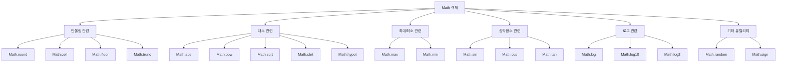
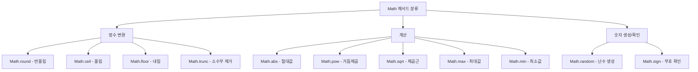
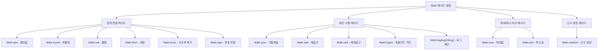

# 29장. Math

> 수학적인 상수와 함수를 위한 프로퍼티와 메서드를 제공하는 빌트인 객체.
> 생성자 함수가 아니다. 정적 프로퍼티와 정적 메서드만 제공.

## Math의 특징

- **정적 객체**: Math는 정적(static) 객체로, 인스턴스를 생성하지 않고 직접 호출하여 사용
- **전역 객체**: 어디서든 접근 가능한 전역 객체로 제공됨
- **수학 관련 기능**: 다양한 수학적 계산과 상수를 제공

## Math 프로퍼티

#### `Math.PI`

> 원의 둘레와 지름의 비율(π)을 나타내는 상수

- 특징:
  - 값: 약 3.141592653589793
  - 수학에서 사용되는 원주율(π)과 동일

```js
console.log(Math.PI); // 3.141592653589793

// 원의 넓이 계산
const radius = 2;
const area = Math.PI * radius * radius;
console.log(area); // 12.566370614359172
```

## Math 메서드

#### `Math.abs(x)`

> 주어진 숫자의 절대값을 반환

- 특징:
  - 인수: 임의의 숫자
  - 음수를 양수로 변환
  - 0이나 양수는 그대로 반환
  - 숫자가 아닌 값은 Number로 변환 후 처리

```js
console.log(Math.abs(-10)); // 10
console.log(Math.abs(10)); // 10
console.log(Math.abs(-Infinity)); // Infinity
console.log(Math.abs("-1")); // 1 (문자열 -> 숫자 변환)
console.log(Math.abs(null)); // 0 (null -> 0 변환)
console.log(Math.abs("string")); // NaN
```

#### `Math.ceil(x)`

> 주어진 숫자보다 크거나 같은 가장 작은 정수를 반환 (올림)

- 특징:
  - 인수: 임의의 숫자
  - 소수점 이하를 올림하여 정수 반환
  - 음수의 경우에도 올림 적용(더 큰 정수로)

```js
console.log(Math.ceil(1.4)); // 2
console.log(Math.ceil(1.6)); // 2
console.log(Math.ceil(-1.4)); // -1
console.log(Math.ceil(-1.6)); // -1
console.log(Math.ceil(1)); // 1
```

#### `Math.floor(x)`

> 주어진 숫자보다 작거나 같은 가장 큰 정수를 반환 (내림)

- 특징:
  - 인수: 임의의 숫자
  - 소수점 이하를 내림하여 정수 반환
  - 음수의 경우에도 내림 적용(더 작은 정수로)

```js
console.log(Math.floor(1.9)); // 1
console.log(Math.floor(1.1)); // 1
console.log(Math.floor(-1.1)); // -2
console.log(Math.floor(-1.9)); // -2
console.log(Math.floor(1)); // 1
```

#### `Math.round(x)`

> 주어진 숫자를 가장 가까운 정수로 반올림

- 특징:
  - 인수: 임의의 숫자
  - 소수점 이하가 0.5 이상이면 올림, 미만이면 내림
  - 정수에 가장 가까운 값으로 반올림

```js
console.log(Math.round(1.4)); // 1
console.log(Math.round(1.5)); // 2
console.log(Math.round(-1.4)); // -1
console.log(Math.round(-1.5)); // -1
console.log(Math.round(-1.6)); // -2
```

#### `Math.sqrt(x)`

> 주어진 숫자의 제곱근을 반환

- 특징:
  - 인수: 0 이상의 숫자
  - 음수를 인수로 전달하면 NaN 반환
  - x의 제곱근(√x) 계산

```js
console.log(Math.sqrt(4)); // 2
console.log(Math.sqrt(2)); // 1.4142135623730951
console.log(Math.sqrt(1)); // 1
console.log(Math.sqrt(0)); // 0
console.log(Math.sqrt(-4)); // NaN (음수의 제곱근은 실수에서 정의되지 않음)
```

#### `Math.random()`

> 0 이상 1 미만의 난수(무작위 실수)를 반환

- 특징:
  - 인수: 없음
  - 0 이상 1 미만의 부동소수점 의사 난수를 생성
  - 암호학적으로 안전한 난수가 필요하면 `crypto.getRandomValues()` 사용 권장

```js
console.log(Math.random()); // 0 이상 1 미만의 무작위 수 (예: 0.734967217076895)

// 특정 범위의 난수 생성 (최소값(min)부터 최대값(max)까지)
function getRandomInt(min, max) {
  min = Math.ceil(min);
  max = Math.floor(max);
  return Math.floor(Math.random() * (max - min + 1)) + min;
}

console.log(getRandomInt(1, 10)); // 1부터 10까지의 무작위 정수
```

#### `Math.pow(x, y)`

> x의 y승을 반환 (x^y)

- 특징:
  - 첫 번째 인수(x): 밑값
  - 두 번째 인수(y): 지수
  - ES7부터는 지수 연산자(\*\*) 사용 가능

```js
console.log(Math.pow(2, 3)); // 8 (2^3)
console.log(Math.pow(3, 2)); // 9 (3^2)
console.log(Math.pow(2, 0.5)); // 1.4142135623730951 (√2)
console.log(Math.pow(2, -2)); // 0.25 (1/2^2)

// ES7 지수 연산자 사용
console.log(2 ** 3); // 8
```

#### `Math.max(...values)`

> 주어진 숫자 중 가장 큰 값을 반환

- 특징:
  - 인수: 임의 개수의 숫자
  - 인수가 없으면 -Infinity 반환
  - 배열을 인수로 전달하려면 스프레드 문법 사용

```js
console.log(Math.max(1, 2, 3, 4, 5)); // 5
console.log(Math.max(-1, -5, -10)); // -1
console.log(Math.max()); // -Infinity

// 배열에서 최대값 찾기
const arr = [1, 2, 3, 4, 5];
console.log(Math.max(...arr)); // 5
```

#### `Math.min(...values)`

> 주어진 숫자 중 가장 작은 값을 반환

- 특징:
  - 인수: 임의 개수의 숫자
  - 인수가 없으면 Infinity 반환
  - 배열을 인수로 전달하려면 스프레드 문법 사용

```js
console.log(Math.min(1, 2, 3, 4, 5)); // 1
console.log(Math.min(-1, -5, -10)); // -10
console.log(Math.min()); // Infinity

// 배열에서 최소값 찾기
const arr = [1, 2, 3, 4, 5];
console.log(Math.min(...arr)); // 1
```

## 추가 학습 자료

**기능별 Math 메서드 분류**



**주요 메서드 기능별 분류**



**메서드 유형별 분류**



## 개인 메모 및 질문
